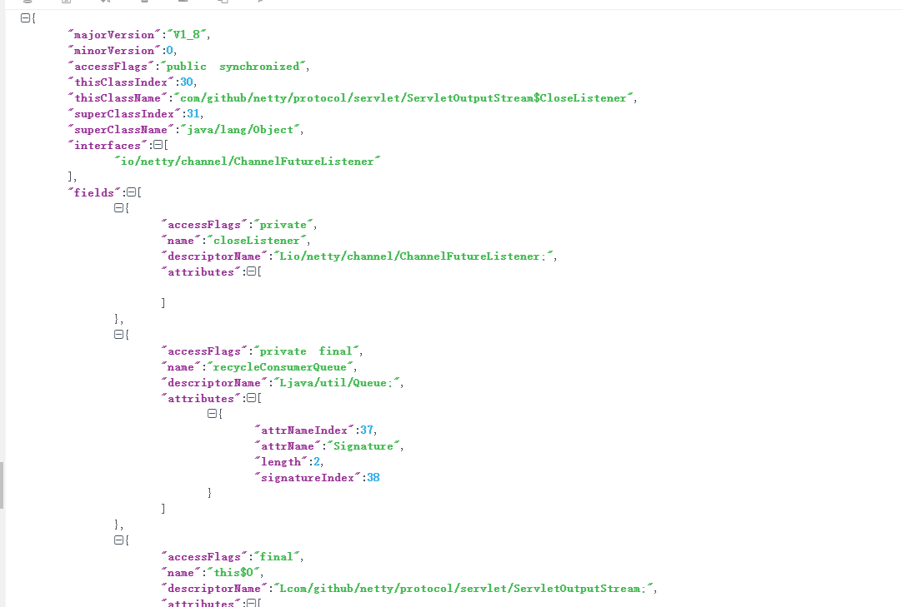

### 用一个类(只依赖jdk)实现了java文件解析，你可以用这个类获取局部变量表，字节码，行号等

 ---

* 这个类toString后是个json，你也可以直接使用get方法获取你需要的类信息（比如：常量池）。

* 类依赖描述

* 方法区,局部变量表,程序指令地址

* 常量池

* 字节码指令,栈深度

* 数据结构如下

 ---
  
### 你可以这样使用它（还有更多信息等你来用）

    JavaClassFile javaClassFile = new JavaClassFile(path,className);
    
    Member[] fields = javaClassFile.getFields();//字段
    Member[] methods = javaClassFile.getMethods();//方法
    ConstantPool constantPool = javaClassFile.getConstantPool();//你可以查看常量池
    Attribute[] attributes = javaClassFile.getAttributes();//你可以查看常量池
    Attribute.LocalVariable[] localVariables = attributes[0].localVariableTable();//你可以查看局部变量
    Opcodes opcodes = (Opcodes) attributes[0].get("opcodes");//你可以查看字节码
    String localVariablesName = localVariables[0].name();//局部变量名称

 ---
 
作者邮箱 : 842156727@qq.com

github地址 : [字节码栈深度.jpg] (字节码栈深度.jpg)

